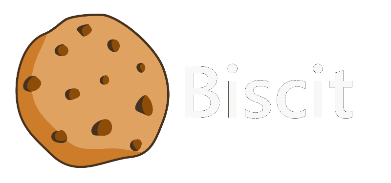

  

<h3>What is Biscit</h3>
<ul>
  <li>Biscit is a full stack open source project.</li>
  <li>The goal is to create a functional 'Discord' like chat application.</li>
  <li>The development will start 1. April 2021.</li>
</ul>

<h3>The technologies</h3>
<b>Backend:</b>
<ul>
  <li>Node.js</li>
  <li>GraphQL</li>
  <li>Socket.io</li>
  <li>WebRTC</li>
  <li>PostgreSQL</li>
</ul>

Frontend:

<ul>
  <li>React</li>
  <li>Next</li>
</ul>

<h3>The plan</h3>
<ol>
  <li>Create basic features for the GraphQL API. (account system, friends, threads)</li>
  <li>Start the React frontend. (login/register page, friend/thread ui, chat window)</li>
  <li>Add chat capability.</li>
  <li>Voice/Video calls, group chats,...</li>
  <li>Electron wrapper for desktop app.</li>
  <li>React-native app for mobile.</li>
</ol>

<h3>The story</h3>

Biscit started a year ago as a PHP/JQuery project... That failed miserably!😂 Half a year later I came back stronger with Node backend and WebSockets but I used a template engine to render the frontend which was probably the worst mistake I made as a full stack developer. I tried finishing it but my code got uglier and uglier until I eventually gave up. So now I hope I finally finish what I started a year ago. 
 
