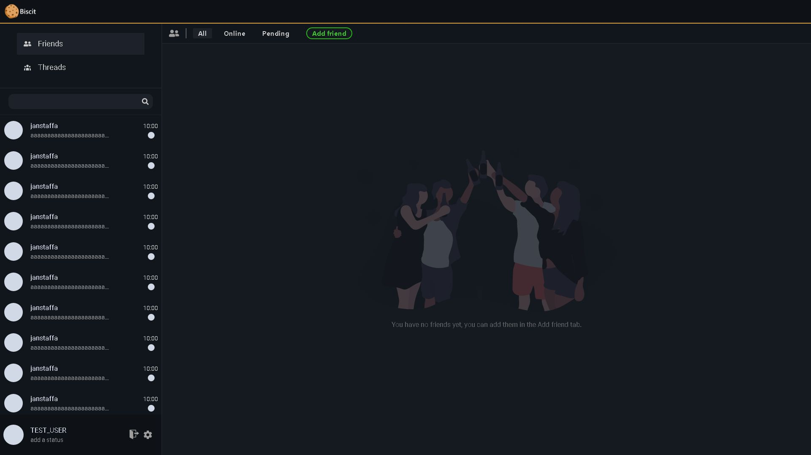

* * *

### What is Biscit

*   Biscit is a full stack open source project.
*   The goal is to create a functional 'Discord' like chat application.
*   The development will start 1\. April 2021.

### Current state

### The technologies

**Backend:**

*   Node.js
*   GraphQL
*   PostgreSQL
*   Redis

**Frontend:**

*   React
*   Next.js

### The plan

1.  Create basic features for the GraphQL API. (account system, friends, threads)
2.  Start the React frontend. (login/register page, friend/thread ui, chat window)
3.  Add chat capability.
4.  Voice/Video calls, group chats,...
5.  Electron wrapper for desktop app.
6.  React-native app for mobile.

### The story

Biscit started a year ago as a PHP/JQuery project... That failed miserably!😂 Half a year later I came back stronger with Node backend and WebSockets but I used a template engine to render the frontend which was probably the worst mistake I made as a full stack developer. I tried finishing it but my code got uglier and uglier until I eventually gave up. So now I hope I finally finish what I started a year ago.
